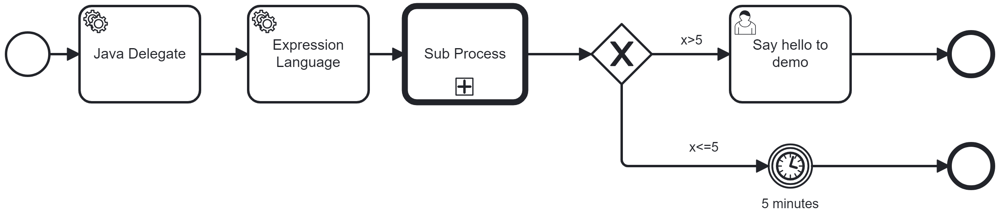

# Complete Test Case

A typical test case includes:

- Bootstrapping the application (e.g. with Spring Boot as shown here)
- Starting a process instance via the client API
- Asserting key milestones such as:
  - Reaching user tasks
  - Completing the process
  - Validating variable values
  - Simulating timers

Note: Distinguish between tests that rely on job workers and those that do not. See our [testing best practices](https://docs.camunda.io/docs/next/components/best-practices/development/testing-process-definitions/) for more context and [Job Execution in Test Cases](./60-job.md) for details.

In this pattern you see a full sample test case for the following process for Camunda 7 and 8:



The test cases starts a process instance and either wait for a user task or a timer to complete, and validate the result. See the various other patterns for details.

## Camunda 7 

[View full source code](https://github.com/camunda/camunda-7-to-8-migration-tooling/blob/main/code-conversion/examples/process-solution-camunda-7/src/test/java/org/camunda/community/migration/example/ApplicationTest.java).

```java
import org.junit.jupiter.api.Test;
//...

import org.camunda.bpm.engine.runtime.ProcessInstance;
import org.camunda.bpm.engine.variable.Variables;

import static org.camunda.bpm.engine.test.assertions.bpmn.BpmnAwareTests.assertThat;
import static org.camunda.bpm.engine.test.assertions.bpmn.BpmnAwareTests.task;
import static org.camunda.bpm.engine.test.assertions.bpmn.BpmnAwareTests.complete;
import static org.camunda.bpm.engine.test.assertions.bpmn.BpmnAwareTests.runtimeService;
import static org.camunda.bpm.engine.test.assertions.bpmn.BpmnAwareTests.findId;

@SpringBootTest
public class ApplicationTest {	

  @Test
  void testHappyPathWithUserTask() {
    ProcessInstance processInstance = runtimeService().startProcessInstanceByKey(
            "sample-process-solution-process",
            Variables.createVariables().putValue("x", 7));
    
    // assert / verify that we arrive in the user task with the name "Say hello to demo"
    assertThat(processInstance).isWaitingAt(findId("Say hello to demo"));
    assertThat(task())
    	.hasName("Say hello to demo")
    	.isAssignedTo("demo");
    
    // complete that task, so that the process instance advances
    complete(task());

    // Assert that it completed in the right end event, and that a Spring Bean hooked into the service task has written the expected process variable
    assertThat(processInstance).isEnded().hasPassed("Event_GreaterThan5");
    assertThat(processInstance).variables().containsEntry("theAnswer", 42);
  }

  @Test
  void testTimerPath() {
    ProcessInstance processInstance = runtimeService().startProcessInstanceByKey(
                "sample-process-solution-process", //
                Variables.createVariables().putValue("x", 5));
    
    // Query and trigger timer
    // Execute the pending job (e.g. a timer or async)
    Job timerJob = managementService().createJobQuery()
      .processInstanceId(processInstance.getId())
      .singleResult();
    managementService().executeJob(timerJob.getId());

    assertThat(processInstance).isEnded().hasPassed("Event_SmallerThan5");
  }
```

## Camunda 8

Camunda 8 uses its client APIs and [Camunda Process Test (CPT)](https://docs.camunda.io/docs/next/apis-tools/testing/getting-started/) for the same test case.

 [View full source code](https://github.com/camunda/camunda-7-to-8-migration-tooling/blob/main/code-conversion/examples/process-solution-camunda-8/src/test/java/org/camunda/community/migration/example/ApplicationTest.java).

```java
import org.junit.jupiter.api.Test;
//...

import io.camunda.client.CamundaClient;
import io.camunda.client.api.response.ProcessInstanceEvent;
import io.camunda.process.test.api.CamundaProcessTestContext;
import io.camunda.process.test.api.CamundaSpringProcessTest;
import io.camunda.process.test.api.assertions.UserTaskSelectors;

import static io.camunda.process.test.api.CamundaAssert.assertThat;
import static io.camunda.process.test.api.assertions.ElementSelectors.byName;

@SpringBootTest
@CamundaSpringProcessTest
public class ApplicationTest {

  @Autowired
  private CamundaClient client;

  @Autowired
  private CamundaProcessTestContext processTestContext;

  @Test
  void testHappyPathWithUserTask() {
    HashMap<String, Object> variables = new HashMap<String, Object>();
    variables.put("x", 7);

    ProcessInstanceEvent processInstance = client.newCreateInstanceCommand()
      .bpmnProcessId("sample-process-solution-process").latestVersion() //
      .variables(variables) //
      .send().join();

    // assert / verify that we arrive in the user task with the name "Say hello to demo"
    assertThat(processInstance).isActive();
    assertThat(processInstance).hasActiveElements(byName("Say hello to demo"));

    assertThat(UserTaskSelectors.byTaskName("Say hello to demo")) //
      .isCreated()
      .hasName("Say hello to demo")
      .hasAssignee("demo");

    // Using utility method to complete user task found by name
    processTestContext.completeUserTask("Say hello to demo");

    // Assert that it completed in the right end event, and that a Spring Bean hooked into the service task has written the expected process variable
    assertThat(processInstance) //
      .isCompleted() //
      .hasCompletedElements("Event_GreaterThan5");

    // Additional check to verify the expression is working properly
    assertThat(processInstance).hasVariableNames("theAnswer");
    assertThat(processInstance).hasVariable("theAnswer", 42);
  }

  @Test
  void testTimerPath() {
    HashMap<String, Object> variables = new HashMap<String, Object>();
    variables.put("x", 5);

    ProcessInstanceEvent processInstance = client.newCreateInstanceCommand()
      .bpmnProcessId("sample-process-solution-process").latestVersion() //
      .variables(variables) //
      .send().join();

    // increase time so that the timer event is triggered and the process moves on
    processTestContext.increaseTime(Duration.ofMinutes(6));
    
    assertThat(processInstance).isCompleted().hasCompletedElements("Event_SmallerThan5");
  }

}
```